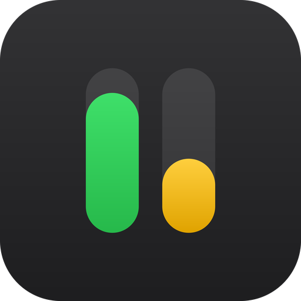

  

<h1 align="center">QuotaBar</h1>

  <b>How much Codex and Claude you have left — in your macOS menu bar.</b>

  
  
  

QuotaBar puts two compact indicators in the menu bar — one for Codex (OpenAI),
one for Claude (Anthropic) — each showing the quota you have **left** in the
short and weekly windows. Click for a small popover. No windows, no Dock icon,
no settings beyond a Launch at Login toggle.

It reads the credentials the two CLIs already store on your Mac. It never logs
in, never refreshes a token, never writes a credential anywhere.

## Install

**[Download the latest `.dmg`](https://github.com/cayde-6/QuotaBar/releases/latest)**, mount it,
and drag `QuotaBar.app` onto the `Applications` alias next to it.

Requires **macOS 14 (Sonoma) or later**, plus whichever CLIs you want to
track — [`codex`](https://github.com/openai/codex) and/or
[Claude Code](https://claude.com/claude-code), signed in. A provider you don't
have simply doesn't appear.

> **First launch is blocked by Gatekeeper.** These builds are ad-hoc signed,
> not signed with an Apple Developer ID. Right-click the app and choose
> **Open**, or run `xattr -cr /Applications/QuotaBar.app`. Once.

## Reading the indicators

Each provider shows two numbers, stacked: the short (5-hour) window on top,
the weekly window below. Both are **remaining** percentages, not used ones.

| Colour | Remaining |
|--------|-----------|
| green  | 50% or more |
| yellow | 20–49% |
| red    | under 20% |

The provider icon stays neutral — it follows the menu bar's own light/dark
appearance — so only the numbers carry meaning. Three other states:

- **`—` instead of a number** — that window has no data. This is normal: the
  Codex API does not always report both windows.
- **`!` next to the icon** — the last refresh failed, or the data on screen is
  older than 20 minutes. The last known-good numbers stay visible; open the
  popover to see what went wrong.
- **No icon at all** — that provider isn't set up on this machine, so it drops
  out of the menu bar and the popover entirely instead of sitting there
  permanently marked `!` over nothing.

Providers are independent: if one is unreachable, blocked, or slow, the other
still updates and displays normally.

`Refresh every` in the popover offers 1, 5, 15, 30 or 60 minutes (default 5).
The choice persists across launches. Changing it restarts the timer immediately
and does not itself trigger a refresh.

<b>When exactly a provider is hidden</b>

A provider is hidden only when it has never returned valid data **and** the
reason is unambiguous:

- the `codex` CLI isn't installed (the login shell exits 127), or
- Claude Code has no credentials in `~/.claude/.credentials.json` nor in the
  Keychain.

Anything that might be temporary keeps the provider visible with its `!` — a
locked Keychain, an expired token, a network failure, a timeout, or `codex`
installed but signed out. Install the missing CLI or sign in and the icon
returns on the next refresh; nothing needs restarting.

If neither provider is set up, the menu bar shows a single gauge glyph rather
than collapsing to an empty item, so the popover — and `Quit` — stays
reachable.

<b>Keychain access, and why macOS asks again</b>

QuotaBar reads Claude Code's own OAuth credentials from the macOS Keychain
(item `Claude Code-credentials`), which needs your permission the first time:
*"QuotaBar wants to access key 'Claude Code-credentials'"*. Choose
**Always Allow**.

That grant does not last forever, and not because of a bug here. Claude Code
rewrites the Keychain item every time it refreshes its own OAuth token, and a
rewritten item comes back with a fresh list of trusted applications — so
QuotaBar's permission is dropped every few hours.

**Background refreshes are therefore never allowed to show that prompt.** Only
two paths may: the first refresh after launch, and pressing `Refresh` yourself.
Everything else (the timer, waking from sleep) fails quietly instead, showing
`!` in the menu bar and *"Keychain access needed — click Refresh"* in the
popover. One click restores it. Without this rule the app would stack up system
dialogs overnight.

<b>Why App Sandbox is disabled</b>

App Sandbox is intentionally off, and there is no entitlements file. QuotaBar
needs to:

- Read a Keychain item created by a different application (Claude Code), which
  sandboxed apps cannot do without a shared keychain-access-group entitlement
  that Claude Code doesn't provide.
- Launch an external process (`codex app-server`) via a login shell, which the
  sandbox blocks.

In exchange, QuotaBar is deliberately read-only: it never writes credentials
anywhere, never logs tokens or credential file contents, and never performs a
login or token-refresh flow of its own. If Claude's access token has expired,
QuotaBar reports that and waits — only Claude Code itself is allowed to refresh
it.

## Licence

[MIT](LICENSE) © 2026 Maxim Egorov.

Not affiliated with, endorsed by, or supported by OpenAI or Anthropic.
