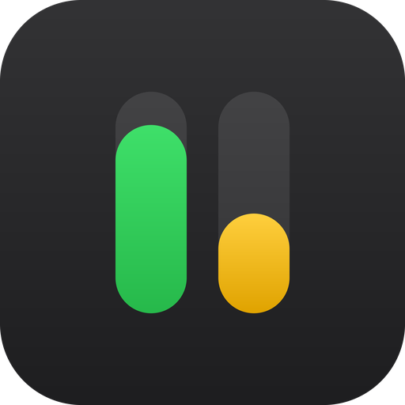
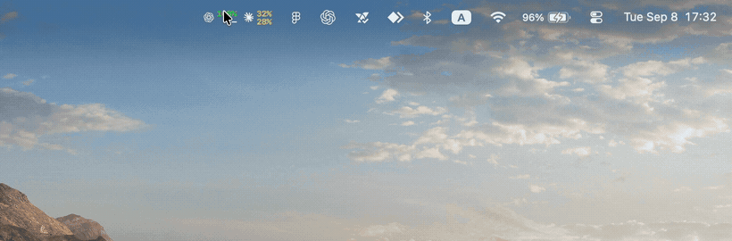
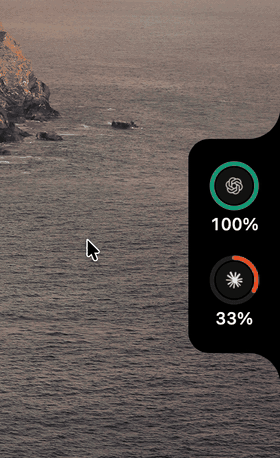

  

<h1 align="center">QuotaBar</h1>

  <b>How much Codex and Claude you have left — in your macOS menu bar.</b>

  
  
  

  

QuotaBar puts two compact indicators in the menu bar — one for Codex (OpenAI),
one for Claude (Anthropic) — showing the quota you have **left** in the
available limit windows. Click for a small popover. No windows, no Dock icon.

If you'd rather not spend menu bar width on it, the same readout can live in a
small floating widget you park against a screen edge — see
[Where the readout lives](#where-the-readout-lives).

It reads the credentials the two CLIs already store on your Mac. It never logs
in, never refreshes a token, never writes a credential anywhere.

## Install

**[Download the latest `.dmg`](https://github.com/cayde-6/QuotaBar/releases/latest)**, mount it,
and drag `QuotaBar.app` onto the `Applications` alias next to it.

Requires **macOS 14 (Sonoma) or later**, plus whichever CLIs you want to
track — [`codex`](https://github.com/openai/codex) and/or
[Claude Code](https://claude.com/claude-code), signed in. A provider you don't
have simply doesn't appear. You can also hide either provider in Settings.

> **First launch is blocked by Gatekeeper.** These builds are ad-hoc signed,
> not signed with an Apple Developer ID. Right-click the app and choose
> **Open**, or run `xattr -cr /Applications/QuotaBar.app`. Once.

## Reading the indicators

When both windows are available, each provider shows two numbers, stacked:
the short (5-hour) window on top and the weekly window below. If only one
window is reported, only its number appears. All numbers are **remaining**
percentages, not used ones.

| Colour | Remaining |
|--------|-----------|
| green  | 50% or more |
| yellow | 20–49% |
| red    | under 20% |

The provider icon stays neutral — it follows the menu bar's own light/dark
appearance — so only the numbers carry meaning. Three other states:

- **`—` instead of a number** — no limit data is available yet.
- **A single `PLAN` column instead of the two windows** — some Codex plans
  (`business`, for one) meter spend against a plan allowance instead of rolling
  5-hour and weekly windows, and report no windows at all. QuotaBar shows that
  allowance and its reset date in their place.
- **`!` next to the icon** — the last refresh failed, or the data on screen is
  older than 20 minutes. The last known-good numbers stay visible; open the
  popover to see what went wrong. The reason is kept to a line or two so it
  can't push the numbers off the card — hover it to read one that got cut off.
- **No icon at all** — that provider isn't set up on this machine, so it drops
  out of the menu bar and the popover entirely instead of sitting there
  permanently marked `!` over nothing.

Providers are independent: if one is unreachable, blocked, or slow, the other
still updates and displays normally.

`Refresh every` in Settings offers 1, 5, 15, 30 or 60 minutes (default 5).
The choice persists across launches. Changing it restarts the timer immediately
and does not itself trigger a refresh.

## Where the readout lives

`Show as` in Settings picks the surface: **Menu bar** (the default), **Widget**,
or **Both**.

The **Providers** switches let you show Codex, Claude, or both. A hidden
provider disappears from every readout and QuotaBar stops checking its usage.
Turning it back on starts a refresh immediately. If both are hidden, the menu
bar item stays available so you can reopen Settings.

The widget is a small dark strip that floats above your windows, with one cell
per provider: a ring around the provider's mark for the shortest available
window, and that window's percentage under it in white. If Codex reports only
a weekly limit, the ring and percentage show that limit. The ring is the
provider's own colour and stays that colour whatever the number is — unlike
the menu bar and the limits card, it is not a green / orange / red warning. `—` means that window
has no data; `!` means the last refresh failed or the numbers are over 20
minutes old.

Click the widget and a dark card opens beside it with the available windows,
their reset times, when the data was last updated, a
`Refresh` button and a gear that opens Settings. It closes on Escape or on a
click anywhere outside it.

  

Drag the widget anywhere; when you let go it docks to whichever screen edge it
ended up nearest — left, right or bottom — and stays there across launches. It
turns to match: a column on the side edges, a row along the bottom, square on
the docked side so it reads as part of the edge rather than as something parked
next to it. There is deliberately no top edge; that one belongs to the menu bar.

  

The position is remembered as a fraction along its edge rather than as pixels,
so changing resolution or unplugging the display it lived on can't strand it
off-screen; a display that disappears sends it back to the one with the menu
bar.

The widget stays visible on every Space and over full-screen apps — being
visible while something else is filling the screen is most of the point. If
neither provider is visible there is nothing to draw and the widget doesn't
appear at all; in that case the menu bar item stays visible whatever `Show as`
says, so Settings — and `Quit` — never becomes unreachable.

## Settings

There is no Dock icon and no menu bar menu, so Settings opens from the gear in
whichever readout you have: the menu bar item's popover, or the widget's card.
It holds the provider switches, surface choice, refresh interval,
`Launch at Login`, the new-version notice, and `Quit`. Escape or ⌘W closes it.

<b>When exactly a provider is hidden</b>

A provider is hidden only when it has never returned valid data **and** the
reason is unambiguous:

- the `codex` CLI isn't installed (the login shell exits 127), or
- Claude Code has no credentials in `~/.claude/.credentials.json` nor in the
  Keychain.

Anything that might be temporary keeps the provider visible with its `!` — a
locked Keychain, an expired token, a network failure, a timeout, or `codex`
installed but signed out. Install the missing CLI or sign in and the icon
returns on the next refresh; nothing needs restarting.

If Anthropic rate-limits the Claude usage check, QuotaBar shows a warning and
pauses automatic Claude requests for at least 15 minutes (or longer if the
server asks). A manual Refresh can retry sooner. QuotaBar keeps any Claude
numbers fetched earlier in the current session; after a restart, it shows no
Claude percentage until the usage check succeeds again.

If no provider is visible, the menu bar shows a single gauge glyph rather than
collapsing to an empty item, so Settings — and `Quit` — stays reachable.

<b>Keychain access, and why macOS asks again</b>

QuotaBar reads Claude Code's own OAuth credentials from the macOS Keychain
(item `Claude Code-credentials`), which needs your permission the first time:
*"QuotaBar wants to access key 'Claude Code-credentials'"*. Choose
**Always Allow**.

That grant does not last forever, and not because of a bug here. Claude Code
rewrites the Keychain item every time it refreshes its own OAuth token, and a
rewritten item comes back with a fresh list of trusted applications — so
QuotaBar's permission is dropped every few hours.

**Background refreshes are therefore never allowed to show that prompt.** Only
two paths may: the first refresh after launch, and pressing `Refresh` yourself.
Everything else (the timer, waking from sleep) fails quietly instead, showing
`!` in the menu bar and *"Keychain access needed — click Refresh"* in the
popover. One click restores it. Without this rule the app would stack up system
dialogs overnight.

<b>Why App Sandbox is disabled</b>

App Sandbox is intentionally off, and there is no entitlements file. QuotaBar
needs to:

- Read a Keychain item created by a different application (Claude Code), which
  sandboxed apps cannot do without a shared keychain-access-group entitlement
  that Claude Code doesn't provide.
- Launch an external process (`codex app-server`) via a login shell, which the
  sandbox blocks.

In exchange, QuotaBar is deliberately read-only: it never writes credentials
anywhere, never logs tokens or credential file contents, and never performs a
login or token-refresh flow of its own. If Claude's access token has expired,
QuotaBar reports that and waits — only Claude Code itself is allowed to refresh
it.

## Licence

[MIT](LICENSE) © 2026 Maxim Egorov.

Not affiliated with, endorsed by, or supported by OpenAI or Anthropic.
